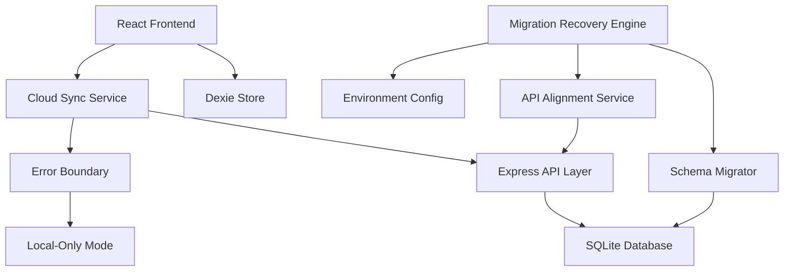

# Design Document: Cloud Database Migration Recovery

## Overview

The Cloud Database Migration Recovery system restores cloud synchronization capabilities to an application currently operating in "Local-Only" mode after a failed migration. The design prioritizes data safety, maintains offline-first architecture, and ensures seamless integration with existing Dexie-based local storage.

The recovery approach focuses on incremental restoration rather than a complete rebuild, preserving the stable local functionality while carefully adding cloud capabilities. The system maintains Dexie as the primary data store with cloud storage serving as a backup and synchronization layer.

## Architecture

### High-Level Architecture



### Component Responsibilities

**Frontend Layer:**
- React UI components maintain existing functionality
- Dexie Store remains primary data source
- Cloud Sync Service handles background synchronization
- Error Boundary provides graceful degradation

**Backend Layer:**
- Express API provides aligned endpoints
- SQLite Database stores cloud data
- Schema Migrator handles safe database changes
- API Alignment Service ensures endpoint consistency

**Recovery Layer:**
- Migration Recovery Engine orchestrates the restoration process
- Environment Config Manager handles configuration validation
- Error handling ensures system stability throughout recovery

## Components and Interfaces

### Cloud Sync Service

```typescript
interface CloudSyncService {
  // Core sync operations
  syncToCloud(localData: LocalData[]): Promise<SyncResult>
  syncFromCloud(): Promise<LocalData[]>
  
  // State management
  isOnline(): boolean
  getLastSyncTimestamp(): Date | null
  
  // Error handling
  enableOfflineMode(): void
  retryFailedOperations(): Promise<void>
}

interface SyncResult {
  success: boolean
  syncedCount: number
  failedCount: number
  errors: SyncError[]
  timestamp: Date
}
```

### Schema Migrator

```typescript
interface SchemaMigrator {
  // Migration operations
  backupCurrentSchema(): Promise<BackupResult>
  applyMigration(migration: Migration): Promise<MigrationResult>
  rollbackMigration(backupId: string): Promise<void>
  
  // Validation
  validateSchema(): Promise<ValidationResult>
  checkDataIntegrity(): Promise<IntegrityResult>
}

interface Migration {
  id: string
  description: string
  upQueries: string[]
  downQueries: string[]
  dataTransforms?: DataTransform[]
}
```

### API Alignment Service

```typescript
interface APIAlignmentService {
  // Endpoint management
  validateEndpoints(): Promise<ValidationResult>
  alignEndpoints(mapping: EndpointMapping[]): Promise<void>
  
  // Runtime validation
  checkEndpointAvailability(endpoint: string): Promise<boolean>
  getEndpointMapping(): EndpointMapping[]
}

interface EndpointMapping {
  frontendPath: string
  backendPath: string
  method: HttpMethod
  dataStructure: DataSchema
}
```

### Error Boundary Component

```typescript
interface ErrorBoundary {
  // Error handling
  handleSyncError(error: SyncError): void
  handleAPIError(error: APIError): void
  
  // Fallback management
  enableLocalOnlyMode(): void
  attemptRecovery(): Promise<RecoveryResult>
  
  // State queries
  isInFallbackMode(): boolean
  getErrorHistory(): ErrorRecord[]
}
```

## Data Models

### Local Data Models (Dexie)

```typescript
// Existing Dexie schema - preserved as-is
interface Business {
  id: string
  name: string
  address: string
  phone?: string
  email?: string
  website?: string
  lastUpdated: Date
}

interface Dataset {
  id: string
  name: string
  description: string
  businesses: Business[]
  createdAt: Date
  lastModified: Date
}
```

### Cloud Data Models (SQLite)

```sql
-- Existing leads table (preserved)
CREATE TABLE IF NOT EXISTS leads (
  id TEXT PRIMARY KEY,
  name TEXT NOT NULL,
  address TEXT NOT NULL,
  phone TEXT,
  email TEXT,
  website TEXT,
  last_updated DATETIME DEFAULT CURRENT_TIMESTAMP
);

-- New datasets table (to be added)
CREATE TABLE IF NOT EXISTS datasets (
  id TEXT PRIMARY KEY,
  name TEXT NOT NULL,
  description TEXT,
  created_at DATETIME DEFAULT CURRENT_TIMESTAMP,
  last_modified DATETIME DEFAULT CURRENT_TIMESTAMP
);

-- Junction table for dataset-business relationships
CREATE TABLE IF NOT EXISTS dataset_businesses (
  dataset_id TEXT,
  business_id TEXT,
  PRIMARY KEY (dataset_id, business_id),
  FOREIGN KEY (dataset_id) REFERENCES datasets(id),
  FOREIGN KEY (business_id) REFERENCES leads(id)
);
```

### Sync State Models

```typescript
interface SyncState {
  lastSyncTimestamp: Date | null
  pendingOperations: PendingOperation[]
  conflictResolutions: ConflictResolution[]
  errorLog: SyncError[]
}

interface PendingOperation {
  id: string
  type: 'CREATE' | 'UPDATE' | 'DELETE'
  entityType: 'business' | 'dataset'
  entityId: string
  data: any
  timestamp: Date
  retryCount: number
}
```

### Configuration Models

```typescript
interface EnvironmentConfig {
  apiUrl: string
  isDevelopment: boolean
  enableCloudSync: boolean
  syncIntervalMs: number
  maxRetryAttempts: number
  fallbackToLocal: boolean
}

interface MigrationConfig {
  backupRetentionDays: number
  validateBeforeMigration: boolean
  rollbackOnFailure: boolean
  batchSize: number
}
```

## Correctness Properties

*A property is a characteristic or behavior that should hold true across all valid executions of a system—essentially, a formal statement about what the system should do. Properties serve as the bridge between human-readable specifications and machine-verifiable correctness guarantees.*

### Property 1: Data Synchronization Integrity
*For any* local data in Dexie_Store, when uploaded to Cloud_Data and synchronized back, the resulting data should be identical to the original, maintaining consistency throughout all sync operations.
**Validates: Requirements 1.1, 1.5, 8.4**

### Property 2: Bidirectional Sync with Timestamp Updates
*For any* cloud data update, when synchronized to local storage, the local data should reflect the changes and the system should update the last sync timestamp.
**Validates: Requirements 1.2, 1.3**

### Property 3: Conflict Resolution Preserves Local Data
*For any* sync conflict scenario, the local data should always be preserved as the source of truth, regardless of cloud data state.
**Validates: Requirements 1.4**

### Property 4: Offline Operation Continuity
*For any* system operation, when network connectivity or cloud services are unavailable, all operations should continue to function using local data only.
**Validates: Requirements 2.1, 2.3**

### Property 5: Automatic Sync Recovery
*For any* period of network unavailability, when connectivity is restored, the system should automatically resume sync operations without manual intervention.
**Validates: Requirements 2.2**

### Property 6: Operation Queuing and Processing
*For any* sync operation attempted while offline, the operation should be queued and processed when connectivity returns.
**Validates: Requirements 2.4**

### Property 7: Exponential Backoff Retry Pattern
*For any* failed sync operation, the system should retry with exponentially increasing delays until success or maximum retry limit.
**Validates: Requirements 2.5**

### Property 8: Migration Safety with Backup
*For any* schema migration operation, the system should create a backup before applying changes and preserve all existing data.
**Validates: Requirements 3.1, 3.2**

### Property 9: Backward Compatibility Preservation
*For any* existing functionality (Dexie operations, API endpoints, local workflows), the system should maintain full compatibility after migration recovery.
**Validates: Requirements 3.3, 9.1, 9.2, 9.3**

### Property 10: SQL Injection Prevention
*For any* database operation, the system should use named parameters to prevent SQL injection vulnerabilities.
**Validates: Requirements 3.4, 8.2**

### Property 11: Migration Rollback on Failure
*For any* migration that fails, the system should automatically rollback to the previous schema state without data loss.
**Validates: Requirements 3.5**

### Property 12: API Endpoint Consistency
*For any* frontend API request, there should be a corresponding backend endpoint that accepts the request and returns consistent data structures.
**Validates: Requirements 4.1, 4.5**

### Property 13: Startup Validation Completeness
*For any* system startup, all API endpoint mappings and environment configurations should be validated before the system becomes available.
**Validates: Requirements 4.4, 7.3**

### Property 14: TypeScript Compilation Cleanliness
*For any* codebase state, the system should compile with zero TypeScript errors and no unused variables.
**Validates: Requirements 5.2, 5.5**

### Property 15: System Resilience Under Errors
*For any* error condition (sync failures, backend crashes, API mismatches), the system should gracefully degrade to local-only mode while preserving all user data and providing clear error messages.
**Validates: Requirements 6.1, 6.2, 6.3, 6.4, 6.5**

### Property 16: Environment Configuration Robustness
*For any* environment (development, production), the system should properly configure API URLs with appropriate fallbacks when environment variables are missing.
**Validates: Requirements 7.1, 7.2, 7.4, 7.5**

### Property 17: Transaction Boundary Enforcement
*For any* bulk data operation, the system should wrap the operation in transaction boundaries to ensure atomicity.
**Validates: Requirements 8.1**

### Property 18: Data Validation Integrity
*For any* data validation failure, the system should reject the operation and maintain data integrity without corruption.
**Validates: Requirements 8.3**

### Property 19: Detailed Error Logging
*For any* parameter mapping issue or system error, the system should log detailed error information for debugging purposes.
**Validates: Requirements 8.5**

### Property 20: Dual-Mode Operation Support
*For any* system state after recovery completion, both local-only and cloud-synchronized operations should function correctly.
**Validates: Requirements 9.4**

## Error Handling

### Error Categories and Responses

**Network Connectivity Errors:**
- Automatic fallback to local-only mode
- Queue operations for later synchronization
- Retry with exponential backoff
- User notification of offline status

**Data Synchronization Errors:**
- Preserve local data as source of truth
- Log detailed error information
- Attempt conflict resolution
- Graceful degradation without data loss

**Schema Migration Errors:**
- Automatic rollback to previous state
- Preserve all existing data
- Detailed error logging
- User notification of migration failure

**API Endpoint Errors:**
- Fallback to alternative endpoints
- Clear error messaging
- Maintain local functionality
- Log endpoint availability issues

**Build and Compilation Errors:**
- Fail fast with clear error messages
- Prevent deployment of broken code
- Maintain type safety
- Provide actionable error information

### Error Recovery Strategies

**Automatic Recovery:**
- Network connectivity restoration
- Sync operation retry mechanisms
- Schema migration rollback
- Endpoint availability checking

**Manual Recovery:**
- User-initiated sync retry
- Manual migration rollback
- Configuration reset options
- Data export/import capabilities

**Graceful Degradation:**
- Local-only mode activation
- Reduced functionality with clear communication
- Data preservation priority
- User workflow continuity

## Testing Strategy

### Dual Testing Approach

The testing strategy employs both unit testing and property-based testing to ensure comprehensive coverage:

**Unit Tests:**
- Specific examples of sync operations
- Edge cases for network failures
- Integration points between components
- Error condition handling
- API endpoint validation

**Property-Based Tests:**
- Universal properties across all data inputs
- Comprehensive input coverage through randomization
- Minimum 100 iterations per property test
- Each test references its design document property

### Property-Based Testing Configuration

**Testing Library:** QuickCheck-style property testing (fast-check for TypeScript/JavaScript)

**Test Configuration:**
- Minimum 100 iterations per property test
- Custom generators for business data, datasets, and sync states
- Shrinking enabled for minimal failing examples
- Timeout configuration for long-running sync operations

**Test Tagging Format:**
Each property test must include a comment with the format:
```
// Feature: cloud-database-migration-recovery, Property N: [property description]
```

**Property Test Implementation Requirements:**
- Each correctness property must be implemented by exactly one property-based test
- Tests must generate random valid inputs for comprehensive coverage
- Tests must verify the universal property holds across all generated inputs
- Failed tests must provide minimal counterexamples for debugging

### Testing Phases

**Pre-Migration Testing:**
- Validate current system state
- Test existing functionality preservation
- Verify backup creation capabilities

**Migration Testing:**
- Test schema migration safety
- Validate rollback mechanisms
- Test API endpoint alignment

**Post-Migration Testing:**
- Verify dual-mode operation
- Test sync functionality end-to-end
- Validate error handling and recovery

**Regression Testing:**
- Ensure existing functionality remains intact
- Test backward compatibility
- Validate build system reliability